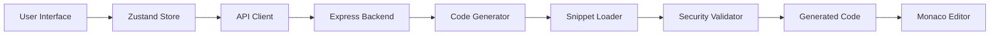

# 🚀 Code Snippet Generator - AI-Powered Code Snippet Generator

<div align="center">


**Générez du code structuré, sécurisé et testable en quelques clics pour HTML5, CSS3, JavaScript, Java, PHP et SQL**

[✨ Fonctionnalités](#-fonctionnalités) • [🚀 Démarrage rapide](#-démarrage-rapide) • [📖 Documentation](#-documentation) • [🤝 Contribution](#-contribution) • [📄 Licence](#-licence)

[](https://github.com/hrmonic/code-snippet-generator/stargazers)
[](https://github.com/hrmonic/code-snippet-generator/network/members)
[](https://github.com/hrmonic/code-snippet-generator/issues)
[](https://github.com/hrmonic/code-snippet-generator/pulls)

</div>

---

## 📋 Table des matières

- [À propos](#-à-propos)
- [✨ Fonctionnalités](#-fonctionnalités)
- [🛠️ Stack technique](#️-stack-technique)
- [🚀 Démarrage rapide](#-démarrage-rapide)
- [📖 Guide d'utilisation](#-guide-dutilisation)
- [🏗️ Architecture](#️-architecture)
- [🔒 Sécurité](#-sécurité)
- [🧪 Tests](#-tests)
- [📦 Structure du projet](#-structure-du-projet)
- [🤝 Contribution](#-contribution)
- [📄 Licence](#-licence)
- [👤 Auteur](#-auteur)

---

## 🎯 À propos

**Code Snippet Generator** est un outil web moderne et open-source qui permet aux développeurs de générer rapidement du code de production pour les langages les plus populaires. Que vous ayez besoin d'un formulaire HTML5, d'une API REST en PHP, d'un CRUD complet en Java, ou de requêtes SQL sécurisées, Code Snippet Generator génère du code propre, commenté, sécurisé et prêt à l'emploi.

### 🎨 Pourquoi Code Snippet Generator ?

- ⚡ **Rapidité** : Générez du code en secondes au lieu de minutes
- 🔒 **Sécurité** : Code généré avec protection contre SQL injection, XSS, et autres vulnérabilités
- 📝 **Qualité** : Code structuré, commenté et suivant les meilleures pratiques
- 🧪 **Testable** : Inclut des exemples de tests pour chaque snippet
- 🎯 **Multi-langages** : Support de 6 langages populaires
- 📱 **Responsive** : Interface moderne et adaptée mobile/desktop
- 🆓 **Open Source** : 100% gratuit et open-source

---

## ✨ Fonctionnalités

### 🎯 Génération de code intelligente

- **6 langages supportés** : HTML5, CSS3, JavaScript, Java, PHP, SQL
- **13+ types de snippets** : Formulaires, API REST, CRUD, Animations, Requêtes DB, Validation, Layouts
- **Personnalisation avancée** : Options configurables selon le besoin
- **Code prêt à l'emploi** : Aucun placeholder, code 100% fonctionnel

### 📝 Éditeur en temps réel

- **Monaco Editor** : L'éditeur de code de VS Code dans votre navigateur
- **Syntax highlighting** : Coloration syntaxique pour tous les langages
- **Auto-complétion** : Suggestions intelligentes
- **Copie/Téléchargement** : Exportez votre code en un clic

### 🔒 Sécurité intégrée

- ✅ Protection contre **SQL Injection** avec prepared statements
- ✅ Protection contre **XSS** (Cross-Site Scripting)
- ✅ Validation **Zod** côté backend
- ✅ Sanitization des entrées utilisateur
- ✅ Code généré suivant les **OWASP Top 10**

### 🧪 Code testable

- Exemples de tests inclus pour chaque snippet
- Structure de tests prête à l'emploi
- Couverture de code > 90% sur le projet

### 📱 Design moderne

- Interface **responsive** (mobile-first)
- **TailwindCSS** pour un design moderne
- **Dark mode ready** (à venir)
- Expérience utilisateur optimisée

---

## 🛠️ Stack technique

### Frontend

| Technologie | Version | Usage |
|------------|---------|-------|
| **React** | 18.2.0 | Framework UI |
| **Vite** | 5.1.0 | Build tool ultra-rapide |
| **TypeScript** | 5.3.3 | Typage statique |
| **TailwindCSS** | 3.4.1 | Framework CSS |
| **Zustand** | 4.5.0 | State management léger |
| **Monaco Editor** | 0.45.0 | Éditeur de code |
| **Vitest** | 1.2.1 | Framework de tests |

### Backend

| Technologie | Version | Usage |
|------------|---------|-------|
| **Node.js** | 20+ | Runtime JavaScript |
| **Express** | 4.18.2 | Framework web |
| **TypeScript** | 5.3.3 | Typage statique |
| **Zod** | 3.22.4 | Validation de schémas |
| **Jest** | 29.7.0 | Framework de tests |

### DevOps

- **GitHub Actions** : CI/CD automatique
- **ESLint** : Linting du code
- **Prettier** : Formatage automatique
- **Monorepo** : Workspace npm pour frontend/backend

---

## 🚀 Démarrage rapide

### Prérequis

- **Node.js** >= 20.0.0
- **npm** >= 10.0.0 (ou yarn/pnpm)

### Installation

```bash
# 1. Cloner le repository
git clone https://github.com/hrmonic/code-snippet-generator.git
cd code-snippet-generator

# 2. Installer les dépendances
npm install

# 3. Lancer en mode développement
npm run dev
```

L'application sera accessible sur :
- **Frontend** : http://localhost:5173
- **Backend API** : http://localhost:3000

### 🐳 Alternative avec Docker (à venir)

```bash
docker-compose up
```

---

## 📖 Guide d'utilisation

### Exemple 1 : Générer un CRUD PHP

1. **Sélectionnez le langage** : Cliquez sur **PHP** 🐘
2. **Choisissez le besoin** : Sélectionnez **CRUD**
3. **Configurez les options** :
   - Nom de la table : `users`
   - Nom de l'entité : `User`
   - Champs : `id,name,email,created_at`
4. **Générez** : Cliquez sur "Générer le code"
5. **Résultat** : Code complet avec `UserController.php` incluant :
   - Méthodes CRUD (Create, Read, Update, Delete)
   - Protection SQL injection avec PDO
   - Code commenté et structuré

### Exemple 2 : Créer un formulaire HTML5

1. **Sélectionnez** : **HTML5** 🌐
2. **Choisissez** : **Formulaire**
3. **Configurez** :
   - Nom du formulaire : `contact`
   - Action : `/submit`
   - Méthode : `POST`
4. **Générez** : Code HTML5 avec validation native

### Exemple 3 : API REST JavaScript

1. **Sélectionnez** : **JavaScript** ⚡
2. **Choisissez** : **API Client**
3. **Configurez** :
   - Endpoint : `/api/users`
   - Méthode : `GET`
4. **Générez** : Client HTTP avec fetch, gestion d'erreurs, etc.

---

## 🏗️ Architecture

### Structure monorepo

```
code-snippet-generator/
├── frontend/                 # Application React
│   ├── src/
│   │   ├── components/       # Composants UI réutilisables
│   │   ├── editor/           # Intégration Monaco Editor
│   │   ├── store/             # Zustand state management
│   │   ├── lib/              # Utilitaires et API client
│   │   └── types/            # Types TypeScript
│   └── package.json
│
├── server/                    # API Express
│   ├── src/
│   │   ├── routes/           # Routes API REST
│   │   ├── lib/              # Logique métier
│   │   │   ├── codeGenerator.ts  # Factory/Strategy patterns
│   │   │   └── security/     # Fonctions de sécurisation
│   │   └── data/
│   │       └── snippets/     # Snippets JSON par langage
│   └── package.json
│
└── package.json              # Workspace root
```

### Flux de données



### Patterns de design

- **Factory Pattern** : Génération de code selon langage/feature
- **Strategy Pattern** : Stratégies différentes par langage
- **Repository Pattern** : Abstraction du chargement des snippets
- **Adapter Pattern** : Normalisation des formats de snippets

---

## 🔒 Sécurité

Code Snippet Generator prend la sécurité très au sérieux. Tous les snippets générés incluent :

### ✅ Protection SQL Injection

```php
// ✅ Code généré (sécurisé)
$stmt = $pdo->prepare("SELECT * FROM users WHERE id = :id");
$stmt->bindValue(':id', $id, PDO::PARAM_INT);

// ❌ Jamais de code vulnérable
$query = "SELECT * FROM users WHERE id = " . $_GET['id'];
```

### ✅ Protection XSS

```javascript
// ✅ Code généré (sécurisé)
const sanitized = security.escapeHtml(userInput);

// ❌ Jamais de code vulnérable
element.innerHTML = userInput;
```

### ✅ Validation des entrées

- Validation **Zod** côté backend
- Sanitization des noms de tables/colonnes
- Vérification des types de données
- Rate limiting (à venir)

---

## 🧪 Tests

### Couverture de code

Objectif : **90%+ de couverture**

```bash
# Tests frontend (Vitest)
npm run test --workspace=frontend

# Tests backend (Jest)
npm run test --workspace=server

# Tous les tests avec couverture
npm test
```

### Structure des tests

- ✅ Tests unitaires pour chaque composant
- ✅ Tests d'intégration pour les routes API
- ✅ Tests de sécurité pour les fonctions de validation
- ✅ Tests E2E (à venir)

---

## 📦 Structure du projet

### Snippets disponibles

#### HTML5
- 📝 Formulaires avec validation native
- 🎨 Inputs HTML5 (email, date, color, etc.)
- 📐 Layouts responsive sémantiques

#### CSS3
- 🎨 Animations avec keyframes
- 📐 Layouts Grid et Flexbox
- 📱 Media queries responsive

#### JavaScript
- 🌐 Client API avec fetch
- ✅ Validation de formulaires
- 🎬 Animations avec requestAnimationFrame

#### Java
- 🏗️ CRUD complet avec Spring
- 🌐 API REST avec endpoints
- 📦 Structure Controller/Service/Model

#### PHP
- 🏗️ CRUD avec PDO (sécurisé)
- 🌐 API REST avec validation
- 🔒 Protection SQL injection

#### SQL
- 📊 Requêtes SELECT/INSERT/UPDATE/DELETE
- 🔒 Prepared statements
- 📈 Requêtes avec JOIN et agrégation

---

## 🤝 Contribution

Les contributions sont les bienvenues ! Code Snippet Generator est un projet open-source et nous adorons recevoir des contributions de la communauté.

### Comment contribuer ?

1. **Fork** le projet
2. **Créez** une branche (`git checkout -b feature/AmazingFeature`)
3. **Commitez** vos changements (`git commit -m 'Add some AmazingFeature'`)
4. **Push** vers la branche (`git push origin feature/AmazingFeature`)
5. **Ouvrez** une Pull Request

### Standards de code

- ✅ TypeScript strict mode
- ✅ ESLint rules
- ✅ Tests pour nouvelles fonctionnalités
- ✅ Documentation JSDoc
- ✅ Couverture > 90%

### Ajouter un nouveau snippet

Voir [CONTRIBUTING.md](CONTRIBUTING.md) pour le guide complet.

---

## 📊 Statistiques du projet


---

## 🗺️ Roadmap

- [ ] Support de plus de langages (Python, Go, Rust)
- [ ] Mode sombre (Dark mode)
- [ ] Export en plusieurs formats (ZIP, Git repo)
- [ ] Intégration avec IDE (VS Code extension)
- [ ] API publique pour intégration
- [ ] Templates personnalisables
- [ ] Historique des générations
- [ ] Partage de snippets entre utilisateurs

---

## 📄 Licence

Ce projet est sous licence **MIT**. Voir le fichier [LICENSE](LICENSE) pour plus de détails.

---

## 👤 Auteur

**Réda Touzani** ([@hrmonic](https://github.com/hrmonic))

- 🌐 [GitHub](https://github.com/hrmonic)
- 💼 [LinkedIn](https://linkedin.com/in/reda-touzani)
- 📧 Contact : [via GitHub](https://github.com/hrmonic)

---

## 🙏 Remerciements

- [Monaco Editor](https://microsoft.github.io/monaco-editor/) - Éditeur de code incroyable
- [React](https://react.dev/) - Framework UI
- [TailwindCSS](https://tailwindcss.com/) - Framework CSS
- Tous les [contributeurs](https://github.com/hrmonic/code-snippet-generator/graphs/contributors) qui rendent ce projet meilleur

---

<div align="center">

**⭐ Si ce projet vous a aidé, n'hésitez pas à lui donner une étoile ! ⭐**

[⬆ Retour en haut](#-code-snippet-generator---ai-powered-code-generator)

Fait avec ❤️ pour la communauté des développeurs

</div>
