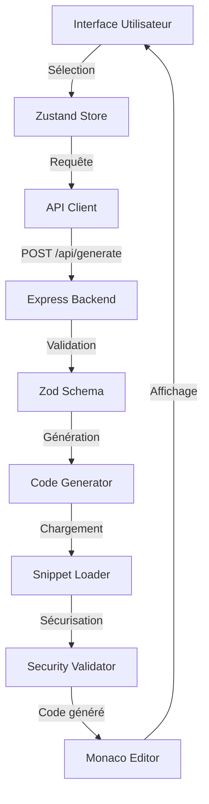

# 🚀 Code Snippet Generator

<div align="center">


**Générez du code structuré, sécurisé et testable en quelques clics pour HTML5, CSS3, JavaScript, Java, PHP et SQL**

> ✨ **Nouveau en v2.0** : Options dynamiques, prévisualisation en temps réel, groupes d'options, validation en temps réel, export ZIP, et bien plus !

[](https://github.com/hrmonic/code-snippet-generator/stargazers)
[](https://github.com/hrmonic/code-snippet-generator/network/members)
[](https://github.com/hrmonic/code-snippet-generator/issues)
[](https://github.com/hrmonic/code-snippet-generator/pulls)
[](https://github.com/hrmonic/code-snippet-generator/commits/main)

[🚀 Démarrage rapide](#-démarrage-rapide) • [📖 Documentation](#-documentation-complète) • [💡 Exemples](#-exemples-dutilisation) • [🤝 Contribution](#-contribution) • [📄 Licence](#-licence)

[](https://vercel.com/new/clone?repository-url=https://github.com/hrmonic/code-snippet-generator)
[](https://app.netlify.com/start/deploy?repository=https://github.com/hrmonic/code-snippet-generator)

</div>

---

## 📖 À propos

**Code Snippet Generator** est un outil web open-source et gratuit qui permet aux développeurs de générer rapidement du code de production prêt à l'emploi. Que vous développiez en **HTML5**, **CSS3**, **JavaScript**, **Java**, **PHP** ou **SQL**, cet outil génère du code propre, commenté, sécurisé et suivant les meilleures pratiques de l'industrie.

### ✨ Pourquoi utiliser Code Snippet Generator ?

| Fonctionnalité | Avantage |
|---------------|----------|
| ⚡ **Rapidité** | Générez du code en secondes au lieu de minutes |
| 🔒 **Sécurité** | Protection intégrée contre SQL injection, XSS et autres vulnérabilités |
| 📝 **Qualité** | Code structuré, commenté et suivant les standards OWASP |
| 🧪 **Testable** | Exemples de tests inclus pour chaque snippet généré |
| 🎯 **Multi-langages** | Support de 6 langages populaires avec 40+ types de snippets |
| 📱 **Responsive** | Interface moderne adaptée desktop et mobile |
| 🎨 **UI/UX Professionnelle** | Interface intuitive avec options groupées et aide contextuelle |
| 🆓 **100% Gratuit** | Open-source sous licence MIT |

---

## 🎯 Fonctionnalités principales

### 🛠️ Génération de code intelligente

- ✅ **6 langages supportés** : HTML5, CSS3, JavaScript, Java, PHP, SQL
- ✅ **66+ types de snippets** : Formulaires, API REST, CRUD, Animations, Requêtes DB, Validation, Layouts, React Hooks, Redux, WebSocket, et bien plus
- ✅ **Options dynamiques** : Chargement automatique des options configurables pour chaque snippet
- ✅ **Personnalisation avancée** : Options groupées par catégories (Style, Comportement, Sécurité, etc.)
- ✅ **Code production-ready** : Aucun placeholder, code 100% fonctionnel et exécutable
- ✅ **Fichiers multiples** : Support de la génération de plusieurs fichiers (ex: CRUD Java avec Controller, Model, Service)

### 📝 Éditeur de code intégré

- ✅ **Monaco Editor** : L'éditeur de VS Code directement dans votre navigateur
- ✅ **Syntax highlighting** : Coloration syntaxique pour tous les langages supportés
- ✅ **Auto-complétion** : Suggestions intelligentes en temps réel
- ✅ **Prévisualisation en temps réel** : Génération automatique du code pendant la configuration
- ✅ **Export avancé** : Copie en un clic, téléchargement individuel ou ZIP pour fichiers multiples

### 🎨 Interface utilisateur moderne

- ✅ **UI/UX professionnelle** : Interface intuitive et moderne avec Tailwind CSS
- ✅ **Options groupées** : Organisation des options par catégories avec sections repliables
- ✅ **Aide contextuelle** : Tooltips et descriptions pour chaque option
- ✅ **Validation en temps réel** : Feedback immédiat sur les erreurs de saisie
- ✅ **Dépendances conditionnelles** : Affichage dynamique des options selon les sélections
- ✅ **Loading states** : Indicateurs de chargement élégants pour toutes les opérations
- ✅ **Accessibilité** : Support complet des attributs ARIA et navigation au clavier

### 🔒 Sécurité de niveau entreprise

- ✅ **Protection SQL Injection** : Prepared statements dans tous les snippets SQL/PHP
- ✅ **Protection XSS** : Échappement automatique des caractères dangereux
- ✅ **Validation Zod** : Validation stricte côté backend de toutes les entrées
- ✅ **Sanitization** : Nettoyage automatique des entrées utilisateur
- ✅ **Conformité OWASP** : Code généré suivant les recommandations OWASP Top 10

### 🧪 Qualité et tests

- ✅ **Tests inclus** : Exemples de tests unitaires pour chaque snippet
- ✅ **Couverture élevée** : Objectif de 90%+ de couverture de code
- ✅ **CI/CD intégré** : GitHub Actions pour tests automatiques
- ✅ **TypeScript strict** : Typage fort pour une meilleure robustesse

---

## 🚀 Démarrage rapide

### 📋 Prérequis

Avant de commencer, assurez-vous d'avoir installé :

- **Node.js** >= 20.0.0 ([Télécharger](https://nodejs.org/))
- **npm** >= 10.0.0 (inclus avec Node.js) ou **yarn** / **pnpm**

### ⚡ Installation en 3 étapes

```bash
# 1. Cloner le repository
git clone https://github.com/hrmonic/code-snippet-generator.git
cd code-snippet-generator

# 2. Installer les dépendances
npm install

# 3. Lancer l'application
npm run dev
```

🎉 **C'est tout !** L'application sera accessible sur :
- **Frontend** : http://localhost:5173
- **Backend API** : http://localhost:3000

### 🎬 Utilisation rapide

1. **Sélectionnez un langage** : Choisissez parmi HTML5, CSS3, JavaScript, Java, PHP ou SQL
2. **Choisissez un type de snippet** : Formulaires, CRUD, API, Animations, etc.
3. **Configurez les options** : Les options sont organisées par groupes (Style, Comportement, Sécurité, etc.)
4. **Prévisualisez en temps réel** : Le code se génère automatiquement pendant que vous configurez
5. **Générez le code final** : Cliquez sur "Générer le code" pour obtenir la version finale
6. **Exportez** : Copiez dans le presse-papiers ou téléchargez (fichier unique ou ZIP pour plusieurs fichiers)

### 🐳 Alternative avec Docker (bientôt disponible)

```bash
docker-compose up
```

### 📝 Variables d'environnement

Créez un fichier `.env` à la racine du projet (optionnel) :

```env
# Frontend
VITE_API_URL=http://localhost:3000

# Backend
PORT=3000
NODE_ENV=development
```

---

## 💡 Exemples d'utilisation

### Exemple 1 : Générer un CRUD Java complet (multi-fichiers)

**Scénario** : Vous avez besoin d'un CRUD complet pour gérer des utilisateurs en Java avec Spring.

**Étapes** :
1. Sélectionnez **Java** ☕ comme langage
2. Choisissez **CRUD** comme type de snippet
3. Configurez les options dans les groupes :
   - **Options de base** : Nom de l'entité `User`, nom de la table `users`
   - **Champs** : Sélectionnez les champs nécessaires (id, name, email, etc.)
   - **Options avancées** : Activez les validations, pagination, etc.
4. Le code se prévisualise automatiquement pendant la configuration
5. Cliquez sur **"Générer le code"**

**Résultat** : Plusieurs fichiers générés :
- ✅ `UserController.java` : Endpoints REST complets
- ✅ `User.java` : Entité JPA avec annotations
- ✅ `UserService.java` : Logique métier
- ✅ Code commenté, sécurisé et prêt à l'emploi
- ✅ Export possible en ZIP ou fichiers individuels

### Exemple 2 : Créer un formulaire HTML5 avec validation

**Scénario** : Vous avez besoin d'un formulaire de contact avec validation native HTML5.

**Étapes** :
1. Sélectionnez **HTML5** 🌐
2. Choisissez **Formulaire**
3. Configurez les options dans les groupes :
   - **Options de base** : Nom du formulaire `contact`, action `/api/contact`
   - **Champs du formulaire** : Sélectionnez les champs (nom, email, message, etc.)
   - **Style et Apparence** : Choisissez les couleurs, espacements, etc.
   - **Comportement** : Activez la validation, les messages d'erreur, etc.
4. La prévisualisation se met à jour automatiquement
5. Générez le code final

**Résultat** : Formulaire HTML5 complet avec :
- ✅ Validation native HTML5
- ✅ Champs sécurisés (email, tel, etc.)
- ✅ Structure sémantique
- ✅ Accessibilité intégrée (ARIA)
- ✅ Styles personnalisés selon vos choix

### Exemple 3 : Navbar HTML5 responsive avec options avancées

**Scénario** : Vous avez besoin d'une barre de navigation responsive avec menu hamburger.

**Étapes** :
1. Sélectionnez **HTML5** 🌐
2. Choisissez **Navbar**
3. Configurez les options :
   - **Options de base** : Nom du site, langue de la page
   - **Style et Apparence** : Couleur de fond, couleur du texte, ombre
   - **Comportement** : Navbar sticky, effet hover, etc.
   - **Liens de navigation** : Sélectionnez les liens (Accueil, À propos, Contact, etc.)
4. La prévisualisation HTML se met à jour en temps réel
5. Générez le code final

**Résultat** : Navbar HTML5 complète avec :
- ✅ Menu hamburger responsive
- ✅ Styles personnalisés selon vos choix
- ✅ Navigation accessible au clavier
- ✅ Code CSS intégré optimisé
- ✅ Compatible mobile et desktop

---

## 🛠️ Stack technique

### Frontend

| Technologie | Version | Rôle |
|------------|---------|------|
| [React](https://react.dev/) | 18.2.0 | Framework UI moderne |
| [Vite](https://vitejs.dev/) | 5.1.0 | Build tool ultra-rapide |
| [TypeScript](https://www.typescriptlang.org/) | 5.3.3 | Typage statique |
| [TailwindCSS](https://tailwindcss.com/) | 3.4.1 | Framework CSS utility-first |
| [Zustand](https://zustand-demo.pmnd.rs/) | 4.5.0 | State management léger |
| [Monaco Editor](https://microsoft.github.io/monaco-editor/) | 0.45.0 | Éditeur de code VS Code |
| [Vitest](https://vitest.dev/) | 1.2.1 | Framework de tests |

### Backend

| Technologie | Version | Rôle |
|------------|---------|------|
| [Node.js](https://nodejs.org/) | 20+ | Runtime JavaScript |
| [Express](https://expressjs.com/) | 4.18.2 | Framework web |
| [TypeScript](https://www.typescriptlang.org/) | 5.3.3 | Typage statique |
| [Zod](https://zod.dev/) | 3.22.4 | Validation de schémas |
| [Jest](https://jestjs.io/) | 29.7.0 | Framework de tests |

### DevOps & Outils

- **GitHub Actions** : CI/CD automatique
- **ESLint** : Linting du code
- **Prettier** : Formatage automatique
- **Monorepo** : Workspace npm pour frontend/backend

---

## 📖 Documentation complète

### 🏗️ Architecture du projet

```
code-snippet-generator/
├── frontend/                    # Application React
│   ├── src/
│   │   ├── components/          # Composants UI réutilisables
│   │   │   ├── LanguageSelector.tsx
│   │   │   ├── FeatureSelector.tsx
│   │   │   ├── SnippetOptions.tsx  # Options dynamiques avec groupes
│   │   │   ├── OptionInput.tsx      # Inputs typés (text, select, checkbox, etc.)
│   │   │   ├── OptionGroup.tsx      # Groupes d'options repliables
│   │   │   ├── OptionHelp.tsx       # Aide contextuelle
│   │   │   ├── CodeViewer.tsx       # Éditeur avec prévisualisation
│   │   │   ├── ExportMenu.tsx       # Export (copie, téléchargement, ZIP)
│   │   │   └── LoadingSpinner.tsx   # Indicateurs de chargement
│   │   ├── hooks/                # Hooks React personnalisés
│   │   │   ├── useSnippetOptions.ts # Chargement des options depuis l'API
│   │   │   └── usePreview.ts        # Prévisualisation en temps réel
│   │   ├── editor/              # Intégration Monaco Editor
│   │   ├── store/               # Zustand state management
│   │   │   ├── useGeneratorStore.ts # État de génération
│   │   │   └── useHistoryStore.ts   # Historique et favoris
│   │   ├── lib/                 # Utilitaires et API client
│   │   │   ├── generator.ts     # Client API pour génération
│   │   │   ├── clipboard.ts     # Utilitaires copie presse-papiers
│   │   │   └── download.ts      # Utilitaires téléchargement
│   │   └── types/               # Types TypeScript
│   └── package.json
│
├── server/                      # API Express
│   ├── src/
│   │   ├── routes/              # Routes API REST
│   │   │   ├── generate.ts      # POST /api/generate
│   │   │   └── snippets.ts     # GET /api/snippets
│   │   ├── lib/
│   │   │   ├── codeGenerator.ts    # Factory/Strategy patterns
│   │   │   ├── snippetLoader.ts    # Chargement des snippets
│   │   │   ├── optionTransformer.ts # Transformation des options pour le frontend
│   │   │   └── security/           # Fonctions de sécurisation
│   │   └── data/
│   │       ├── snippets/          # Snippets JSON par langage
│   │       └── options/           # Cache des options transformées
│   │           ├── html5/
│   │           ├── css3/
│   │           ├── javascript/
│   │           ├── java/
│   │           ├── php/
│   │           └── sql/
│   └── package.json
│
└── package.json                 # Workspace root
```

### 🔄 Flux de données



### 🎨 Patterns de design utilisés

- **Factory Pattern** : Génération de code selon langage/feature
- **Strategy Pattern** : Stratégies différentes par langage
- **Repository Pattern** : Abstraction du chargement des snippets
- **Adapter Pattern** : Normalisation des formats de snippets

---

## 🔒 Sécurité

Code Snippet Generator prend la sécurité très au sérieux. Tous les snippets générés incluent des protections contre les vulnérabilités courantes.

### ✅ Protection SQL Injection

```php
// ✅ Code généré (sécurisé avec PDO)
$stmt = $pdo->prepare("SELECT * FROM users WHERE id = :id");
$stmt->bindValue(':id', $id, PDO::PARAM_INT);
$stmt->execute();

// ❌ Code vulnérable (jamais généré)
$query = "SELECT * FROM users WHERE id = " . $_GET['id'];
```

### ✅ Protection XSS (Cross-Site Scripting)

```javascript
// ✅ Code généré (sécurisé)
const sanitized = security.escapeHtml(userInput);
element.textContent = sanitized;

// ❌ Code vulnérable (jamais généré)
element.innerHTML = userInput;
```

### ✅ Validation des entrées

- **Zod** : Validation stricte côté backend
- **Sanitization** : Nettoyage des noms de tables/colonnes
- **Type checking** : Vérification des types de données
- **Rate limiting** : (à venir)

---

## 🧪 Tests

### Objectif de couverture : 90%+

```bash
# Tests frontend (Vitest)
npm run test --workspace=frontend

# Tests backend (Jest)
npm run test --workspace=server

# Tous les tests avec couverture
npm test

# Tests en mode watch
npm run test --workspace=frontend -- --watch
```

### Structure des tests

- ✅ **Tests unitaires** : Chaque composant et fonction
- ✅ **Tests d'intégration** : Routes API et flux complets
- ✅ **Tests de sécurité** : Validation des fonctions de sécurisation
- ✅ **Tests E2E** : (à venir)

---

## 📦 Snippets disponibles

### 🌐 HTML5 (10 snippets)
- 📝 **Formulaires** : Validation native, champs sécurisés, options avancées
- 🎨 **Inputs** : Types HTML5 modernes (email, date, color, range)
- 📐 **Layouts** : Structure sémantique responsive
- 🧭 **Navbar** : Navigation responsive avec menu hamburger
- 🃏 **Cards** : Composants de carte modernes
- 📊 **Tables** : Tableaux HTML5 avec tri et pagination
- 🎚️ **Sliders** : Carrousels et sliders interactifs
- 🪗 **Accordion** : Sections repliables
- 🪟 **Modal** : Fenêtres modales accessibles

### 🎨 CSS3 (8 snippets)
- 🎬 **Animations** : Keyframes (fadeIn, slideIn, pulse)
- 📐 **Layouts** : Grid et Flexbox responsive
- 📱 **Media queries** : Breakpoints optimisés
- 🎨 **Buttons** : Boutons stylisés avec états hover/focus
- 📊 **Grid** : Systèmes de grille CSS Grid avancés
- 🔄 **Transforms** : Transformations CSS3 (rotate, scale, translate)
- 🎨 **Variables** : CSS Custom Properties (variables CSS)
- 📐 **Flexbox** : Layouts flexbox complets

### ⚡ JavaScript (10 snippets)
- 🌐 **API Client** : Client HTTP avec fetch, gestion d'erreurs
- ✅ **Validation** : Validation de formulaires côté client
- 🎬 **Animations** : requestAnimationFrame pour performance
- 🔄 **Debounce** : Fonctions debounce/throttle
- 📦 **Storage** : Gestion localStorage/sessionStorage
- 🎯 **Event Handling** : Gestionnaires d'événements avancés
- 👁️ **Observer Pattern** : Implémentation du pattern Observer
- ⏳ **Promises** : Gestion des promesses et async/await
- 🏗️ **Classes** : Classes ES6+ avec héritage
- 📡 **Fetch** : Client fetch avec retry et gestion d'erreurs

### ☕ Java (6 snippets)
- 🏗️ **CRUD** : Controller + Model + Service avec Spring (génère plusieurs fichiers)
- 🌐 **API REST** : Endpoints complets avec annotations
- 📦 **Model** : Classes d'entité JPA
- 🔄 **Repository** : Interfaces Repository avec Spring Data
- 🛠️ **Service** : Couche service avec logique métier
- 📋 **DTO** : Data Transfer Objects pour les APIs

### 🐘 PHP (7 snippets)
- 🏗️ **CRUD** : PDO sécurisé, protection SQL injection
- 🌐 **API REST** : Validation, réponses JSON
- 🔒 **Auth** : Système d'authentification sécurisé
- 🛡️ **Middleware** : Middleware pour validation et sécurité
- 🛣️ **Router** : Routeur simple et efficace
- 📦 **Model** : Classes de modèle avec PDO
- ✅ **Validation** : Validateurs de données

### 🗄️ SQL (7 snippets)
- 📊 **Requêtes** : SELECT, INSERT, UPDATE, DELETE sécurisés
- 🔗 **Joins** : INNER, LEFT, RIGHT JOIN avec exemples
- 📈 **Indexes** : Création et optimisation d'index
- 🔄 **Transactions** : Gestion des transactions ACID
- 👁️ **Views** : Vues SQL pour abstraction de données
- 📦 **Stored Procedures** : Procédures stockées avec paramètres et transactions
- ⚡ **Triggers** : Triggers avec gestion d'événements et audit trail

---

## 🤝 Contribution

Les contributions sont les bienvenues ! Code Snippet Generator est un projet open-source et nous adorons recevoir des contributions de la communauté.

### 🚀 Comment contribuer ?

1. **Fork** le projet
2. **Créez** une branche (`git checkout -b feature/AmazingFeature`)
3. **Commitez** vos changements (`git commit -m 'Add some AmazingFeature'`)
4. **Push** vers la branche (`git push origin feature/AmazingFeature`)
5. **Ouvrez** une Pull Request

### 📝 Standards de code

- ✅ TypeScript strict mode
- ✅ ESLint rules respectées
- ✅ Tests pour nouvelles fonctionnalités
- ✅ Documentation JSDoc
- ✅ Couverture > 90%

### ➕ Ajouter un nouveau snippet

Voir [CONTRIBUTING.md](CONTRIBUTING.md) pour le guide complet sur l'ajout de nouveaux snippets.

---

## 📊 Statistiques du projet

<div align="center">


</div>

---

## 🆕 Nouvelles fonctionnalités (v2.0)

### ✨ Améliorations récentes

- ✅ **Options dynamiques** : Chargement automatique des options depuis l'API
- ✅ **Prévisualisation en temps réel** : Génération automatique pendant la configuration
- ✅ **Groupes d'options** : Organisation par catégories avec sections repliables
- ✅ **Validation en temps réel** : Feedback immédiat sur les erreurs
- ✅ **Dépendances conditionnelles** : Affichage dynamique des options
- ✅ **Export ZIP** : Téléchargement de plusieurs fichiers en une archive
- ✅ **Historique et favoris** : Stockage local des générations (à venir)
- ✅ **Aide contextuelle** : Tooltips et descriptions pour chaque option
- ✅ **Support multi-fichiers** : Génération de plusieurs fichiers (ex: CRUD Java)
- ✅ **Accessibilité améliorée** : Support complet ARIA et navigation clavier

## 🗺️ Roadmap

- [x] 📦 Export ZIP pour plusieurs fichiers
- [x] 🎨 Options groupées par catégories
- [x] 👁️ Prévisualisation en temps réel
- [x] ✅ Validation en temps réel
- [ ] 🌙 Mode sombre (Dark mode)
- [ ] 📚 Historique des générations avec localStorage
- [ ] ⭐ Système de favoris
- [ ] 🐍 Support Python
- [ ] 🦀 Support Rust
- [ ] 🐹 Support Go
- [ ] 🔌 Extension VS Code
- [ ] 🌐 API publique pour intégration
- [ ] 📝 Templates personnalisables
- [ ] 👥 Partage de snippets entre utilisateurs
- [ ] 🔍 Recherche de snippets
- [ ] 🧪 Tests E2E avec Playwright

---

## 📄 Licence

Ce projet est sous licence **MIT**. Voir le fichier [LICENSE](LICENSE) pour plus de détails.

```
MIT License

Copyright (c) 2026 Réda Touzani

Permission is hereby granted, free of charge, to any person obtaining a copy
of this software and associated documentation files (the "Software"), to deal
in the Software without restriction...
```

---

## 👤 Auteur

**Réda Touzani** ([@hrmonic](https://github.com/hrmonic))

- 🌐 [GitHub](https://github.com/hrmonic)
- 💼 [LinkedIn](https://linkedin.com/in/reda-touzani)
- 📧 Contact : [via GitHub](https://github.com/hrmonic)

---

## 🙏 Remerciements

Un grand merci à tous ceux qui contribuent à ce projet :

- [Monaco Editor](https://microsoft.github.io/monaco-editor/) - Éditeur de code incroyable
- [React](https://react.dev/) - Framework UI révolutionnaire
- [TailwindCSS](https://tailwindcss.com/) - Framework CSS utility-first
- [Vite](https://vitejs.dev/) - Build tool ultra-rapide
- Tous les [contributeurs](https://github.com/hrmonic/code-snippet-generator/graphs/contributors) qui rendent ce projet meilleur

---

## ⭐ Supportez le projet

Si ce projet vous a aidé, n'hésitez pas à :

- ⭐ **Donner une étoile** sur GitHub
- 🍴 **Forker** le projet
- 🐛 **Signaler un bug** via [Issues](https://github.com/hrmonic/code-snippet-generator/issues)
- 💡 **Suggérer une fonctionnalité** via [Issues](https://github.com/hrmonic/code-snippet-generator/issues)
- 🤝 **Contribuer** au projet

---

<div align="center">

**⭐ Si ce projet vous a aidé, n'hésitez pas à lui donner une étoile ! ⭐**

[⬆ Retour en haut](#-code-snippet-generator)

Fait avec ❤️ pour la communauté des développeurs

**Code Snippet Generator** - Générez du code de qualité en quelques clics

</div>
