# 🚀 Code Snippet Generator

<div align="center">


**Générez du code structuré, sécurisé et testable en quelques clics pour HTML5, CSS3, JavaScript, Java, PHP et SQL**

[](https://github.com/hrmonic/code-snippet-generator/stargazers)
[](https://github.com/hrmonic/code-snippet-generator/network/members)
[](https://github.com/hrmonic/code-snippet-generator/issues)
[](https://github.com/hrmonic/code-snippet-generator/pulls)
[](https://github.com/hrmonic/code-snippet-generator/commits/main)

[🚀 Démarrage rapide](#-démarrage-rapide) • [📖 Documentation](#-documentation-complète) • [💡 Exemples](#-exemples-dutilisation) • [🤝 Contribution](#-contribution) • [📄 Licence](#-licence)

[](https://vercel.com/new/clone?repository-url=https://github.com/hrmonic/code-snippet-generator)
[](https://app.netlify.com/start/deploy?repository=https://github.com/hrmonic/code-snippet-generator)

</div>

---

## 📖 À propos

**Code Snippet Generator** est un outil web open-source et gratuit qui permet aux développeurs de générer rapidement du code de production prêt à l'emploi. Que vous développiez en **HTML5**, **CSS3**, **JavaScript**, **Java**, **PHP** ou **SQL**, cet outil génère du code propre, commenté, sécurisé et suivant les meilleures pratiques de l'industrie.

### ✨ Pourquoi utiliser Code Snippet Generator ?

| Fonctionnalité | Avantage |
|---------------|----------|
| ⚡ **Rapidité** | Générez du code en secondes au lieu de minutes |
| 🔒 **Sécurité** | Protection intégrée contre SQL injection, XSS et autres vulnérabilités |
| 📝 **Qualité** | Code structuré, commenté et suivant les standards OWASP |
| 🧪 **Testable** | Exemples de tests inclus pour chaque snippet généré |
| 🎯 **Multi-langages** | Support de 6 langages populaires avec 13+ types de snippets |
| 📱 **Responsive** | Interface moderne adaptée desktop et mobile |
| 🆓 **100% Gratuit** | Open-source sous licence MIT |

---

## 🎯 Fonctionnalités principales

### 🛠️ Génération de code intelligente

- ✅ **6 langages supportés** : HTML5, CSS3, JavaScript, Java, PHP, SQL
- ✅ **13+ types de snippets** : Formulaires, API REST, CRUD, Animations, Requêtes DB, Validation, Layouts
- ✅ **Personnalisation avancée** : Options configurables selon vos besoins spécifiques
- ✅ **Code production-ready** : Aucun placeholder, code 100% fonctionnel et exécutable

### 📝 Éditeur de code intégré

- ✅ **Monaco Editor** : L'éditeur de VS Code directement dans votre navigateur
- ✅ **Syntax highlighting** : Coloration syntaxique pour tous les langages supportés
- ✅ **Auto-complétion** : Suggestions intelligentes en temps réel
- ✅ **Export facile** : Copie en un clic ou téléchargement du fichier généré

### 🔒 Sécurité de niveau entreprise

- ✅ **Protection SQL Injection** : Prepared statements dans tous les snippets SQL/PHP
- ✅ **Protection XSS** : Échappement automatique des caractères dangereux
- ✅ **Validation Zod** : Validation stricte côté backend de toutes les entrées
- ✅ **Conformité OWASP** : Code généré suivant les recommandations OWASP Top 10

### 🧪 Qualité et tests

- ✅ **Tests inclus** : Exemples de tests unitaires pour chaque snippet
- ✅ **Couverture élevée** : Objectif de 90%+ de couverture de code
- ✅ **CI/CD intégré** : GitHub Actions pour tests automatiques

---

## 🚀 Démarrage rapide

### 📋 Prérequis

Avant de commencer, assurez-vous d'avoir installé :

- **Node.js** >= 20.0.0 ([Télécharger](https://nodejs.org/))
- **npm** >= 10.0.0 (inclus avec Node.js) ou **yarn** / **pnpm**

### ⚡ Installation en 3 étapes

```bash
# 1. Cloner le repository
git clone https://github.com/hrmonic/code-snippet-generator.git
cd code-snippet-generator

# 2. Installer les dépendances
npm install

# 3. Lancer l'application
npm run dev
```

🎉 **C'est tout !** L'application sera accessible sur :
- **Frontend** : http://localhost:5173
- **Backend API** : http://localhost:3000

### 🐳 Alternative avec Docker (bientôt disponible)

```bash
docker-compose up
```

---

## 💡 Exemples d'utilisation

### Exemple 1 : Générer un CRUD PHP complet

**Scénario** : Vous avez besoin d'un CRUD complet pour gérer des utilisateurs en PHP.

**Étapes** :
1. Sélectionnez **PHP** 🐘 comme langage
2. Choisissez **CRUD** comme type de snippet
3. Configurez les options :
   - Nom de la table : `users`
   - Nom de l'entité : `User`
   - Champs : `id,name,email,created_at`
4. Cliquez sur **"Générer le code"**

**Résultat** : Code complet avec `UserController.php` incluant :
- ✅ Méthodes CRUD complètes (Create, Read, Update, Delete)
- ✅ Protection SQL injection avec PDO
- ✅ Code commenté et structuré
- ✅ Gestion d'erreurs intégrée

### Exemple 2 : Créer un formulaire HTML5 avec validation

**Scénario** : Vous avez besoin d'un formulaire de contact avec validation native HTML5.

**Étapes** :
1. Sélectionnez **HTML5** 🌐
2. Choisissez **Formulaire**
3. Configurez :
   - Nom du formulaire : `contact`
   - Action : `/api/contact`
   - Méthode : `POST`
4. Générez le code

**Résultat** : Formulaire HTML5 complet avec :
- ✅ Validation native HTML5
- ✅ Champs sécurisés (email, tel, etc.)
- ✅ Structure sémantique
- ✅ Accessibilité intégrée

### Exemple 3 : Client API JavaScript moderne

**Scénario** : Vous avez besoin d'un client HTTP pour interagir avec une API REST.

**Étapes** :
1. Sélectionnez **JavaScript** ⚡
2. Choisissez **API Client**
3. Configurez :
   - URL de base : `http://localhost:3000/api`
   - Endpoint : `/users`
4. Générez le code

**Résultat** : Classe `ApiClient` complète avec :
- ✅ Méthodes GET, POST, PUT, DELETE
- ✅ Gestion d'erreurs robuste
- ✅ Support des headers personnalisés
- ✅ Compatible avec async/await

---

## 🛠️ Stack technique

### Frontend

| Technologie | Version | Rôle |
|------------|---------|------|
| [React](https://react.dev/) | 18.2.0 | Framework UI moderne |
| [Vite](https://vitejs.dev/) | 5.1.0 | Build tool ultra-rapide |
| [TypeScript](https://www.typescriptlang.org/) | 5.3.3 | Typage statique |
| [TailwindCSS](https://tailwindcss.com/) | 3.4.1 | Framework CSS utility-first |
| [Zustand](https://zustand-demo.pmnd.rs/) | 4.5.0 | State management léger |
| [Monaco Editor](https://microsoft.github.io/monaco-editor/) | 0.45.0 | Éditeur de code VS Code |
| [Vitest](https://vitest.dev/) | 1.2.1 | Framework de tests |

### Backend

| Technologie | Version | Rôle |
|------------|---------|------|
| [Node.js](https://nodejs.org/) | 20+ | Runtime JavaScript |
| [Express](https://expressjs.com/) | 4.18.2 | Framework web |
| [TypeScript](https://www.typescriptlang.org/) | 5.3.3 | Typage statique |
| [Zod](https://zod.dev/) | 3.22.4 | Validation de schémas |
| [Jest](https://jestjs.io/) | 29.7.0 | Framework de tests |

### DevOps & Outils

- **GitHub Actions** : CI/CD automatique
- **ESLint** : Linting du code
- **Prettier** : Formatage automatique
- **Monorepo** : Workspace npm pour frontend/backend

---

## 📖 Documentation complète

### 🏗️ Architecture du projet

```
code-snippet-generator/
├── frontend/                    # Application React
│   ├── src/
│   │   ├── components/          # Composants UI réutilisables
│   │   │   ├── LanguageSelector.tsx
│   │   │   ├── FeatureSelector.tsx
│   │   │   ├── SnippetOptions.tsx
│   │   │   └── CodeViewer.tsx
│   │   ├── editor/              # Intégration Monaco Editor
│   │   ├── store/               # Zustand state management
│   │   ├── lib/                 # Utilitaires et API client
│   │   └── types/               # Types TypeScript
│   └── package.json
│
├── server/                      # API Express
│   ├── src/
│   │   ├── routes/              # Routes API REST
│   │   │   ├── generate.ts      # POST /api/generate
│   │   │   └── snippets.ts     # GET /api/snippets
│   │   ├── lib/
│   │   │   ├── codeGenerator.ts # Factory/Strategy patterns
│   │   │   ├── snippetLoader.ts # Chargement des snippets
│   │   │   └── security/        # Fonctions de sécurisation
│   │   └── data/
│   │       └── snippets/        # Snippets JSON par langage
│   │           ├── html5/
│   │           ├── css3/
│   │           ├── javascript/
│   │           ├── java/
│   │           ├── php/
│   │           └── sql/
│   └── package.json
│
└── package.json                 # Workspace root
```

### 🔄 Flux de données

```mermaid
graph TD
    A[Interface Utilisateur] -->|Sélection| B[Zustand Store]
    B -->|Requête| C[API Client]
    C -->|POST /api/generate| D[Express Backend]
    D -->|Validation| E[Zod Schema]
    E -->|Génération| F[Code Generator]
    F -->|Chargement| G[Snippet Loader]
    G -->|Sécurisation| H[Security Validator]
    H -->|Code généré| I[Monaco Editor]
    I -->|Affichage| A
```



### 🎨 Patterns de design utilisés

- **Factory Pattern** : Génération de code selon langage/feature
- **Strategy Pattern** : Stratégies différentes par langage
- **Repository Pattern** : Abstraction du chargement des snippets
- **Adapter Pattern** : Normalisation des formats de snippets

---

## 🔒 Sécurité

Code Snippet Generator prend la sécurité très au sérieux. Tous les snippets générés incluent des protections contre les vulnérabilités courantes.

### ✅ Protection SQL Injection

```php
// ✅ Code généré (sécurisé avec PDO)
$stmt = $pdo->prepare("SELECT * FROM users WHERE id = :id");
$stmt->bindValue(':id', $id, PDO::PARAM_INT);
$stmt->execute();

// ❌ Code vulnérable (jamais généré)
$query = "SELECT * FROM users WHERE id = " . $_GET['id'];
```

### ✅ Protection XSS (Cross-Site Scripting)

```javascript
// ✅ Code généré (sécurisé)
const sanitized = security.escapeHtml(userInput);
element.textContent = sanitized;

// ❌ Code vulnérable (jamais généré)
element.innerHTML = userInput;
```

### ✅ Validation des entrées

- **Zod** : Validation stricte côté backend
- **Sanitization** : Nettoyage des noms de tables/colonnes
- **Type checking** : Vérification des types de données
- **Rate limiting** : (à venir)

---

## 🧪 Tests

### Objectif de couverture : 90%+

```bash
# Tests frontend (Vitest)
npm run test --workspace=frontend

# Tests backend (Jest)
npm run test --workspace=server

# Tous les tests avec couverture
npm test

# Tests en mode watch
npm run test --workspace=frontend -- --watch
```

### Structure des tests

- ✅ **Tests unitaires** : Chaque composant et fonction
- ✅ **Tests d'intégration** : Routes API et flux complets
- ✅ **Tests de sécurité** : Validation des fonctions de sécurisation
- ✅ **Tests E2E** : (à venir)

---

## 📦 Snippets disponibles

### 🌐 HTML5
- 📝 **Formulaires** : Validation native, champs sécurisés
- 🎨 **Inputs** : Types HTML5 modernes (email, date, color, range)
- 📐 **Layouts** : Structure sémantique responsive

### 🎨 CSS3
- 🎬 **Animations** : Keyframes (fadeIn, slideIn, pulse)
- 📐 **Layouts** : Grid et Flexbox responsive
- 📱 **Media queries** : Breakpoints optimisés

### ⚡ JavaScript
- 🌐 **API Client** : Client HTTP avec fetch, gestion d'erreurs
- ✅ **Validation** : Validation de formulaires côté client
- 🎬 **Animations** : requestAnimationFrame pour performance

### ☕ Java
- 🏗️ **CRUD** : Controller + Model + Service avec Spring
- 🌐 **API REST** : Endpoints complets avec annotations
- 📦 **Architecture** : Structure MVC professionnelle

### 🐘 PHP
- 🏗️ **CRUD** : PDO sécurisé, protection SQL injection
- 🌐 **API REST** : Validation, réponses JSON
- 🔒 **Sécurité** : Prepared statements obligatoires

### 🗄️ SQL
- 📊 **Requêtes** : SELECT, INSERT, UPDATE, DELETE
- 🔒 **Sécurité** : Prepared statements uniquement
- 📈 **Avancé** : JOIN, agrégation, sous-requêtes

---

## 🤝 Contribution

Les contributions sont les bienvenues ! Code Snippet Generator est un projet open-source et nous adorons recevoir des contributions de la communauté.

### 🚀 Comment contribuer ?

1. **Fork** le projet
2. **Créez** une branche (`git checkout -b feature/AmazingFeature`)
3. **Commitez** vos changements (`git commit -m 'Add some AmazingFeature'`)
4. **Push** vers la branche (`git push origin feature/AmazingFeature`)
5. **Ouvrez** une Pull Request

### 📝 Standards de code

- ✅ TypeScript strict mode
- ✅ ESLint rules respectées
- ✅ Tests pour nouvelles fonctionnalités
- ✅ Documentation JSDoc
- ✅ Couverture > 90%

### ➕ Ajouter un nouveau snippet

Voir [CONTRIBUTING.md](CONTRIBUTING.md) pour le guide complet sur l'ajout de nouveaux snippets.

---

## 📊 Statistiques du projet

<div align="center">


</div>

---

## 🗺️ Roadmap

- [ ] 🌙 Mode sombre (Dark mode)
- [ ] 🐍 Support Python
- [ ] 🦀 Support Rust
- [ ] 🐹 Support Go
- [ ] 📦 Export ZIP pour plusieurs fichiers
- [ ] 🔌 Extension VS Code
- [ ] 🌐 API publique pour intégration
- [ ] 📝 Templates personnalisables
- [ ] 📚 Historique des générations
- [ ] 👥 Partage de snippets entre utilisateurs
- [ ] 🔍 Recherche de snippets
- [ ] ⭐ Système de favoris

---

## 📄 Licence

Ce projet est sous licence **MIT**. Voir le fichier [LICENSE](LICENSE) pour plus de détails.

```
MIT License

Copyright (c) 2026 Réda Touzani

Permission is hereby granted, free of charge, to any person obtaining a copy
of this software and associated documentation files (the "Software"), to deal
in the Software without restriction...
```

---

## 👤 Auteur

**Réda Touzani** ([@hrmonic](https://github.com/hrmonic))

- 🌐 [GitHub](https://github.com/hrmonic)
- 💼 [LinkedIn](https://linkedin.com/in/reda-touzani)
- 📧 Contact : [via GitHub](https://github.com/hrmonic)

---

## 🙏 Remerciements

Un grand merci à tous ceux qui contribuent à ce projet :

- [Monaco Editor](https://microsoft.github.io/monaco-editor/) - Éditeur de code incroyable
- [React](https://react.dev/) - Framework UI révolutionnaire
- [TailwindCSS](https://tailwindcss.com/) - Framework CSS utility-first
- [Vite](https://vitejs.dev/) - Build tool ultra-rapide
- Tous les [contributeurs](https://github.com/hrmonic/code-snippet-generator/graphs/contributors) qui rendent ce projet meilleur

---

## ⭐ Supportez le projet

Si ce projet vous a aidé, n'hésitez pas à :

- ⭐ **Donner une étoile** sur GitHub
- 🍴 **Forker** le projet
- 🐛 **Signaler un bug** via [Issues](https://github.com/hrmonic/code-snippet-generator/issues)
- 💡 **Suggérer une fonctionnalité** via [Issues](https://github.com/hrmonic/code-snippet-generator/issues)
- 🤝 **Contribuer** au projet

---

<div align="center">

**⭐ Si ce projet vous a aidé, n'hésitez pas à lui donner une étoile ! ⭐**

[⬆ Retour en haut](#-code-snippet-generator)

Fait avec ❤️ pour la communauté des développeurs

**Code Snippet Generator** - Générez du code de qualité en quelques clics

</div>
